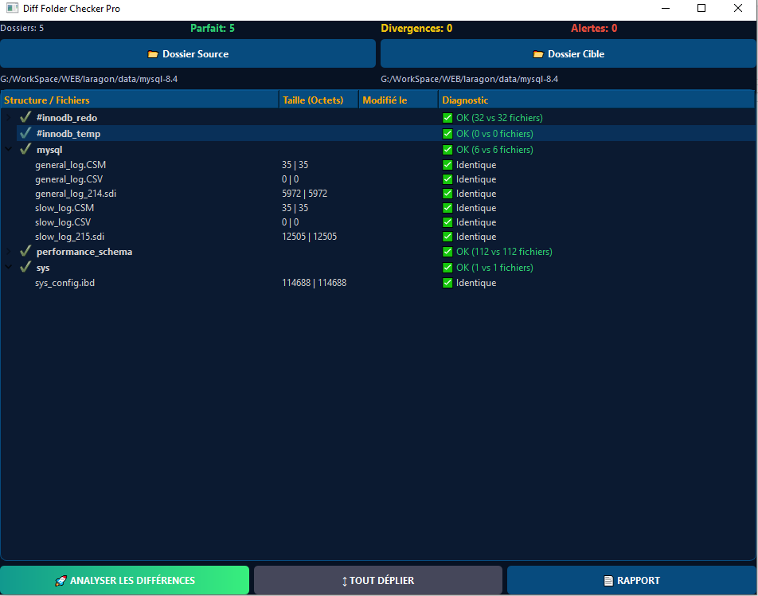

# Diff Folder Checker Pro 🔍



Un outil graphique moderne (PyQt6) pour comparer l'intégrité de deux dossiers. Idéal pour vérifier des sauvegardes, des déploiements ou des bases de données (MySQL/MariaDB).

## Fonctionnalités
- 📂 **Comparaison Hiérarchique** : Visualisez les dossiers et leurs fichiers.
- 🚀 **Analyse Rapide** : Détection instantanée des fichiers manquants ou des tailles divergentes.
- 🎨 **Interface "Director-Friendly"** : Statuts clairs (Vert/Jaune/Rouge) pour ne pas paniquer les décideurs.
- 📄 **Export de Rapport** : Générez un audit complet au format .txt.
- ↕ **Exploration Totale** : Visualisez le contenu des dossiers même s'ils n'existent que d'un côté.

## Installation
```bash
pip install PyQt6
python main.py